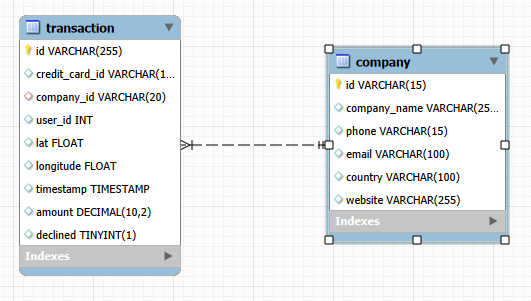

Tras cargar los ficheros [estructura_dades](Init/estructura_dades.sql) y [dades_introduir](Init/dades_introduir.sql), se genera un esquema 'transactions' con dos tablas:

| transaction                                                                                                                                                                                | company                                                                                                                                                               |
| ------------------------------------------------------------------------------------------------------------------------------------------------------------------------------------------ | --------------------------------------------------------------------------------------------------------------------------------------------------------------------- |
| Cada entrada en esta tabla representa una transaccion monetaria cual cuenta como completada (es decir, es una venta) solo cuando declined es False (es igual a 0). Es una tabla de hechos. | Cada entrada en esta tabla representa una empresa. Tal como es una tabla que simplemente añade informacion contextual a las transacciones, es una tabla de dimension. |
| Se ha de mencionar que las variables credit_card_id y user_id son claves foraneas/externas, que enlazan a otras tablas aun no cargadas.                                                    |                                                                                                                                                                       |
Este esquema es un esquema estrella centrado en la tabla de transacciones. Segun el diagrama, una empresa puede tener de una a muchas transacciones, pero realmente es posible que una empresa nueva no tenga transacciones. Por lo contrario, una transaccion tiene una y solo una empresa. Interpreto que una transaccion concluida corresponde a una venta donde el usuario intercambia dinero con la empresa por un bien.