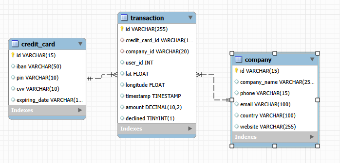

Se puede observar la nueva tabla “credit_card” presente. Es una tabla de dimensión. Una instancia de la tabla “transaction” tiene una (y no menos de una) tarjeta de crédito enlazada. El diagrama indica que una instancia de “credit_card” tiene enlazadas de una a muchas instancias de “transacion”. En realidad, una instancia de “credit_card” no tiene por qué tener una instancia de “transacion” enlazada.