> Benvingut al núvol. En aquest Sprint, faràs el salt de treballar en local (MySQL) a treballar amb **Google BigQuery**, un Data Warehouse serverless dissenyat per a l'anàlisi de dades a gran escala.
> 
> En l'entorn empresarial actual, l'analista no acostuma a crear bases de dades des de zero, sinó que ha de connectar-se a repositoris existents (Data Lakes), comprendre els costos del núvol i preparar les dades brutes per a l'anàlisi (ELT).

#### Lliurament

_Revisa el material a entregar en cada exercici._

- **Codi i Infraestructura (.sql) Els arxius .sql amb tots els scripts generats.**
- **Evidència d'Execució i Rendiment (PDF)** Un document PDF únic que contingui les captures de pantalla de la Consola de BigQuery per a cada exercici.
    - **Requisit Crític**: Per validar que la teva optimització funciona, la captura ha de mostrar clarament:
        - El **codi SQL** a l'editor.
        - El missatge de validació (check verd ✅) o la pestanya Job Information on es vegin els Bytes processats (Bytes processed).

####  ⚠️ Important

Recorda revisar les [millors pràctiques](https://itacademy.barcelonactiva.cat/mod/page/view.php?id=15473) abans de fer el lliurament.

- **Control de Costos**: A BigQuery, cada consulta costa diners. Abans d'executar res, fixa't sempre en el missatge del validador (Dry Run) a dalt a la dreta.
- **Ubicació de les Dades**: Assegura't que el teu Dataset estigui a la regió EU (Multiple regions) o les connexions fallaran.

##### Limitacions del Sandbox

La zona de proves de BigQuery (Sandbox) està subjecta als següents límits:

- S'apliquen tots els límits i quotes habituals de BigQuery.
- Tens 10 GB d'emmagatzematge actiu i 1 TB de dades de consulta processades cada mes sense cap cost.
- ⚠️ **Caducitat**: Totes les taules, vistes i particions caduquen de forma automàtica després de **60 dies**.
- No admet funcions avançades com: Transmissió de dades (Streaming), DML (`UPDATE`/`DELETE` massius) o el Servei de transferència de dades.

---

## Nivell 1: Entorn i Ingesta Híbrida (Code-First)

> ### Escenari:
> 
> Acabeu d'arribar a l'empresa. L'equip d'Enginyeria de Dades ha deixat els fitxers històrics al Data Lake corporatiu.
> 
> La teva primera missió és dissenyar i crear l'entorn de treball. El CTO exigeix ​​professionalitat: no abocarem dades sense ordre, sinó que implementarem una Arquitectura Medallion.

### Exercici 1: Arquitectura de Dades (Lògica vs. Física)

Abans de tocar la consola, has d'entendre la diferència entre allò que dissenyem i allò que construïm:

- **Arquitectura Lògica (Capes de Dades)**: És el disseny conceptual. Organitza les dades segons el seu nivell de qualitat (Bronze, Silver, Gold).
- **Implementació Física (Datasets)**: És el recurs real a Google Cloud. A BigQuery, utilitzarem Datasets (contenidors) per materialitzar físicament aquestes capes lògiques.

#### 🧩 Tasques:

Implementareu físicament l'arquitectura lògica creant tres Datasets dins d'un mateix projecte per centralitzar la facturació i els permisos.

👉 Crea un **Nou Projecte** a Google Cloud anomenat:

`sprint3-analytics-[el-teu-nom]`.

> _Ho pots crear per la UI, però si ho fas per Consola (gcloud CLI) té un plus._

```
gcloud projects create sprint3-analytics-marc-ponce
gcloud config set project sprint3-analytics-marc-ponce
```

» I forgot to screenshot the execution of the command. So I created and deleted a project for the sake of having a screenshot:

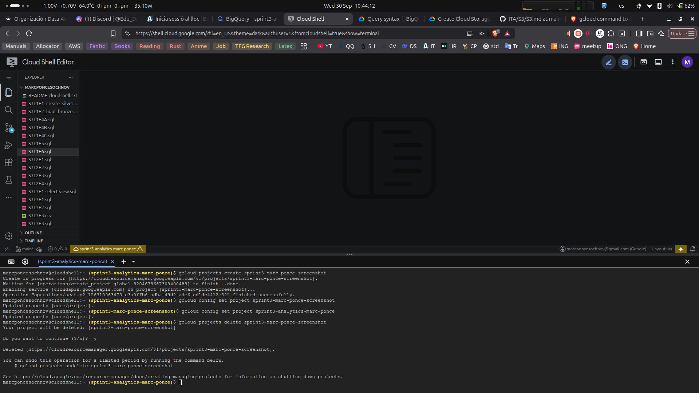

Per demostrar el teu domini total de la plataforma, crearàs cadascun dels datasets utilitzant un mètode diferent:

- **Dataset Físic** `sprint3_bronze` → Capa Lògica Bronze (Dades Crues)
    - Funció: Dades crues tal com arriben de la font.
    - Mètode: Utilitza la **Interfície Gràfica (UI)** de BigQuery (fent clics).

» Click the three points icon in `Datasets` on the left panel, then `Create dataset`. Input the name of the `SCHEMA`, and its location to an EU server: `europe-southwest1` (Madrid).


» The `SCHEMA` was created successfully:


- **Dataset Físic** `sprint3_silver` → Capa Lògica Silver (Dades Netes)
    - Funció: Dades netes, tipades i de-duplicades.
    - Mètode: Utilitza codi SQL (CREATE SCHEMA).

```SQL
/* @datacloud.settings
{
    "version": 1,
    "service": "BIG_QUERY",
    "connectionInfo": {
      "billingProjectId": "sprint3-analytics-marc-ponce",
      "location": "europe-southwest1"
    },
    "dialect": "GOOGLE_SQL"
}
*/

CREATE SCHEMA `sprint3-analytics-marc-ponce.sprint3_silver`
Options (
    location= 'europe-southwest1'
)
```


- **Dataset Físic** `sprint3_gold` → Capa Lògica Gold (Dades de Negoci)
    - Funció: Dades agregades llestes per a informes i panells de control (dashboards).
    - Mètode: Utilitza Cloud Shell (Línia d'ordres bq).

```bash
bq --location=europe-southwest1 \
  mk --dataset sprint3-analytics-marc-ponce:sprint3_gold
```


» In this last screenshot you can confirm that the datasets have been created successfully:


Tingueu en compte la ubicació de les dades originals per decidir la ubicació física dels tres Datasets.

> 📍 **Nota**: Encara que siguin capes lògiques diferents, físicament han de viure a la mateixa regió per poder "parlar" entre elles sense costos de transferència.

### Exercici 2: Ingesta en Capa Bronze (Connexió DDL)

Un analista professional automatitza les tasques. Ara que tens la teva arquitectura a punt, poblarem la primera capa (**Bronze**) sense moure les dades originals, creant **Taules Externes** que apuntin al Data Lake.

#### 🧩 Tasca:

Escriu i executa les sentències `CREATE EXTERNAL TABLE` per connectar els següents fitxers al _dataset_ `sprint3_bronze`. Para molta atenció a les "Notes Tècniques", ja que no tots els arxius tenen el mateix format.

| Taula                | Domini | Ruta al Núvol (URI)                                                              | Notes Tècniques                                                                 |
| -------------------- | ------ | -------------------------------------------------------------------------------- | ------------------------------------------------------------------------------- |
| `transactions_raw`   | ERP    | [transactions.csv](gs://bootcamp-data-analytics-public/ERP/transactions.csv)     | Delimitador: `;`                                                                |
| `companies_raw`      | ERP    | [companies.csv](gs://bootcamp-data-analytics-public/ERP/companies.csv)           | Capçalera: Ignora la 1a fila. Defineix l'esquema manualment perquè tot és text. |
| `american_users_raw` | CRM    | [american_users.csv](gs://bootcamp-data-analytics-public/CRM/american_users.csv) | Estàndard.                                                                      |
| `european_users_raw` | CRM    | [european_users.csv](gs://bootcamp-data-analytics-public/CRM/european_users.csv) | Estàndard.                                                                      |
| `credit_cards_raw`   | CRM    | [credit_cards.csv](gs://bootcamp-data-analytics-public/CRM/credit_cards.csv)     | Estàndard.                                                                      |

#### 👉 Entrega:

El codi SQL utilitzat per a `transactions_raw` i una captura de pantalla amb les 5 taules creades.

» To understand the structure of `companies.csv`, we `cat | head` the file in the terminal:

```bash
gcloud storage cat gs://bootcamp-data-analytics-public/ERP/companies.csv | head -n 10
```

» Here is the resulting table:

| company_id | company_name              | phone          | email                            | country   | website                      |
| ---------- | ------------------------- | -------------- | -------------------------------- | --------- | ---------------------------- |
| b-2222     | Ac Fermentum Incorporated | 06 85 56 52 33 | donec.porttitor.tellus@yahoo.net | Germany   | https://instagram.com/site   |
| b-2226     | Magna A Neque Industries  | 04 14 44 64 62 | risus.donec.nibh@icloud.org      | Australia | https://whatsapp.com/group/9 |

  
» Next I will provide the code, and a screenshot of its successful execution:

```SQL
CREATE OR REPLACE EXTERNAL TABLE
    `sprint3-analytics-marc-ponce.sprint3_bronze.transactions_raw`
OPTIONS (
    format='CSV',
    uris=['gs://bootcamp-data-analytics-public/ERP/transactions.csv'],
    field_delimiter=';'
);

CREATE OR REPLACE EXTERNAL TABLE
    `sprint3-analytics-marc-ponce.sprint3_bronze.companies_raw`
(
    company_id STRING,
    company_name STRING,
    phone STRING,
    email STRING,
    country STRING,
    website STRING
)
OPTIONS (
    format='CSV',
    uris=['gs://bootcamp-data-analytics-public/ERP/companies.csv'],
    skip_leading_rows=1
);

CREATE OR REPLACE EXTERNAL TABLE
    `sprint3-analytics-marc-ponce.sprint3_bronze.american_users_raw`
OPTIONS (
    format='CSV',
    uris=['gs://bootcamp-data-analytics-public/CRM/american_users.csv']
);

CREATE OR REPLACE EXTERNAL TABLE
    `sprint3-analytics-marc-ponce.sprint3_bronze.european_users_raw`
OPTIONS (
    format='CSV',
    uris=['gs://bootcamp-data-analytics-public/CRM/european_users.csv']
);

CREATE OR REPLACE EXTERNAL TABLE
    `sprint3-analytics-marc-ponce.sprint3_bronze.credit_cards_raw`
OPTIONS (
    format='CSV',
    uris=['gs://bootcamp-data-analytics-public/CRM/credit_cards.csv']
);
```


» Lastly we check that the tables are in place:


### Exercici 3: Càrrega de Dades Locals (Upload)

Falta el catàleg de **Productes**. Aquesta informació no és al Data Lake, utilitza el fitxer _products.csv_ de l'Sprint 2.

- Carrega aquest fitxer manualment ("Upload") al dataset `sprint3_bronze` i crea la taula `products_raw`.
- Observa que aquesta serà l'única **Taula Nativa** de moment.

» Upload the `.csv` to `sprint3_bronze.products_raw`


» Confirm its presence in `sprint3_bronze`.


### Exercici 4: Arquitectura i Rendiment. Materialització de Dades (Assistit per IA)

> #### Escenari:
> 
> Les consultes sobre el Data Lake van lentes. Has de demostrar al teu mànager la diferència de rendiment entre treballar amb fitxers externs i treballar amb taules natives de BigQuery.
> 
##### a) **Materialització de Dades (Assistit per IA)**

#### 🧩 Tasca:

Crea una nova taula anomenada `sprint3_bronze.transactions_raw_native` que sigui una còpia exacta de la teva taula externa `transactions_raw`.

###### Requisit de "AI-Pair Programming":

No escriguis el codi SQL manualment. Utilitza l'Assistent d'IA (Gemini) integrat a BigQuery (o el xat lateral) per generar la sentència.

👉 **El Teu Rol**: Ets el responsable de validar que el codi que et dona la IA és correcte abans d'executar-lo.

###### Prompt Suggerit:

_"Write a SQL query to create a new table called `transactions_raw_native` in the sprint3_bronze dataset. It should contain all data from the transactions_raw table. Please use `CREATE OR REPLACE TABLE` so I don't get errors if I run it more than once."_

#### 👉 Entrega:

Una captura de pantalla on es vegi:

- El prompt que vas escriure a la IA.


- El codi SQL que la IA va generar.

```SQL
CREATE OR REPLACE TABLE
    `sprint3-analytics-marc-ponce.sprint3_bronze.transactions_raw_native`
AS SELECT * FROM
    `sprint3-analytics-marc-ponce.sprint3_bronze.transactions_raw`;
```

» So far I can see the code makes sense: we are just creating a table that is not `EXTERNAL`, which I am quite sure means it's `native`. Created from a standard `SELECT *`, the names are not mangled, so I deem this code correct.

- El resultat de l'execució ("This statement created a new table...").

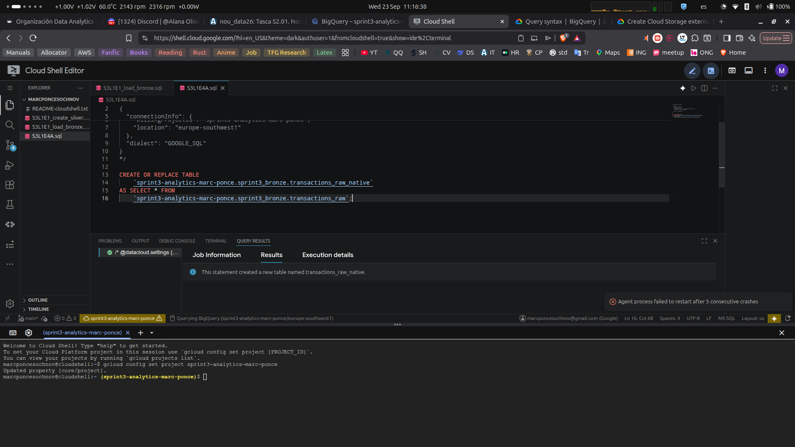

» "This statement created a new table named `transactions_raw_native`."
##### b) **Auditoria de Costos**

#### 🧩 Tasca:

Dissenyar una prova per comparar el cost de llegir una sola columna (ex: `id`) a la taula externa vs. la taula nativa. Utilitza els Bytes processats i els Bytes facturats per fer la comparació.

```SQL
SELECT t.id
FROM `sprint3-analytics-marc-ponce.sprint3_bronze.transactions_raw` AS t;

SELECT t.id
FROM `sprint3-analytics-marc-ponce.sprint3_bronze.transactions_raw_native` AS t;
```

- Quan "pesa" la consulta a `transactions_raw`?

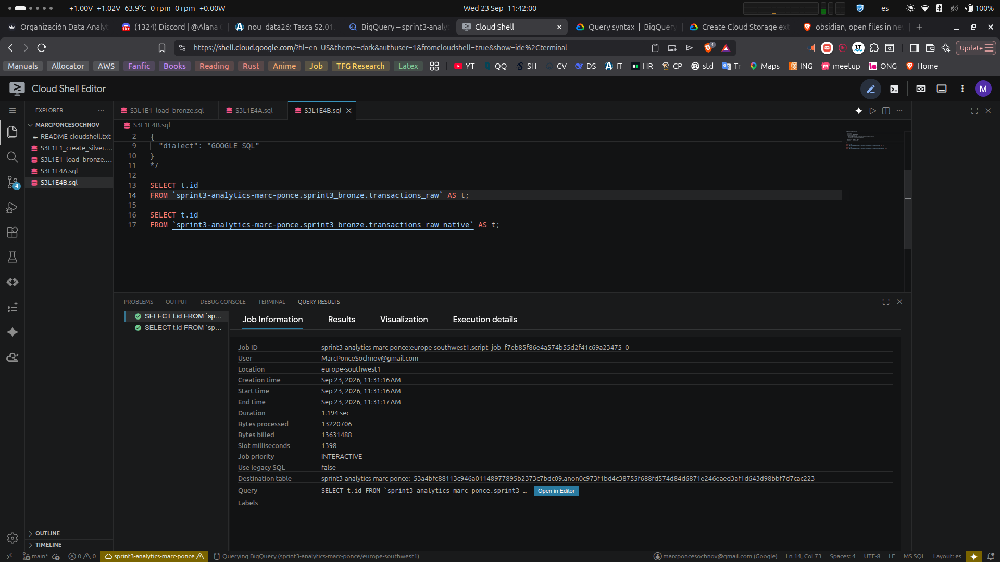


| Processed | Billed    |
| --------- | --------- |
| 13.220 MB | 13.631 MB |

- Quan "pesa" la mateixa consulta a `transactions_raw_native`?

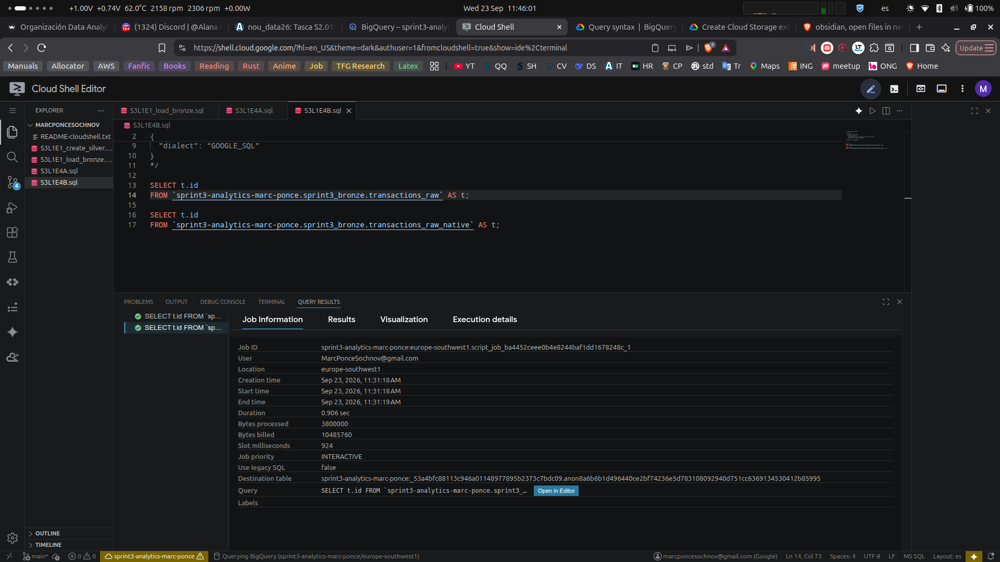


| Processed | Billed    |
| --------- | --------- |
| 3.800 MB  | 10.485 MB |

#### 👉 Entrega:

Captures del validador mostrant la diferència i una conclusió tècnica.

» The difference in billing is of `3MB`, which makes the native table `23%` cheaper. Comparing the execution times, it is also `24%` faster.

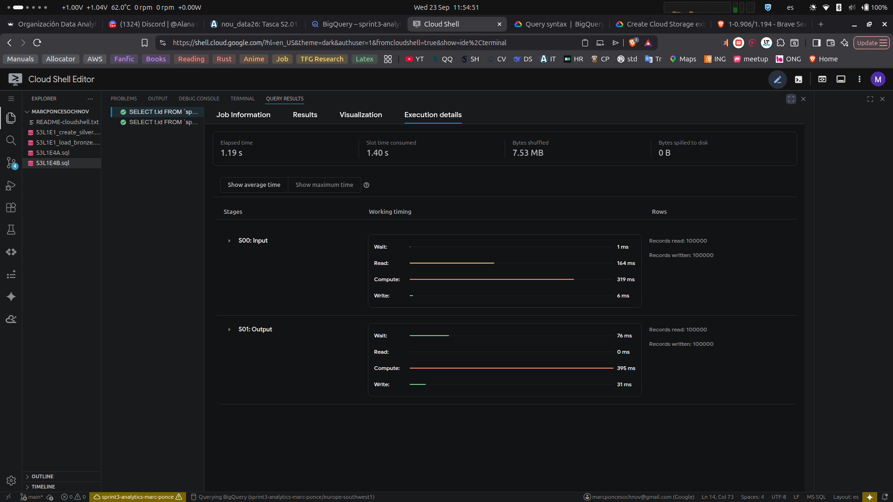

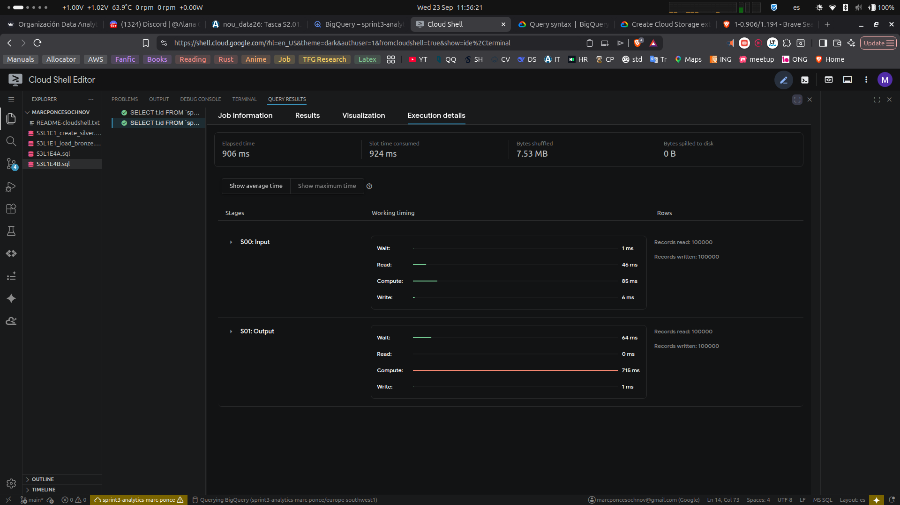

» We can also observe that the `compute` and `read` in `S00` varies much more than some `20-25%`, which might indicate a great difference in energy consumption.

##### c) **El perill del `LIMIT`**

El `LIMIT` estalvia dades processades a BIGQUERY?

#### 🧩 Tasca:

`Fes un **LIMIT 10** sobre la taula transactions_raw_native  y la taula transactions_raw`

```SQL
SELECT t.id
FROM `sprint3-analytics-marc-ponce.sprint3_bronze.transactions_raw` AS t
LIMIT 10;

SELECT t.id
FROM `sprint3-analytics-marc-ponce.sprint3_bronze.transactions_raw_native` AS t
LIMIT 10;
```

> **✅ Comprovació**: Mira el "Dry Run". Ha baixat el cost respecte a no posar `LIMIT`? Explica breument per què això és una trampa per a principiants.

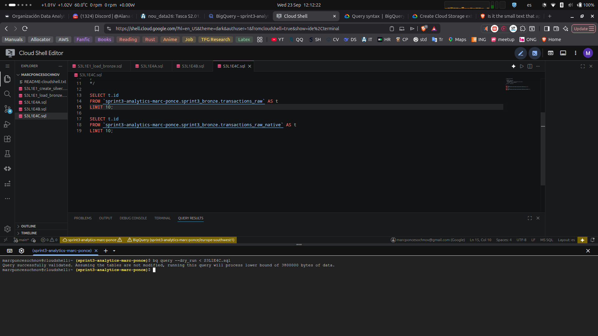

» The dry run yields a lower bound of `3.8MB`. Lower bound means the minimum amount of bytes that it expects will be processed. There is no upper bound. I have to mention that it doesn't seem to account for the `EXTERNAL TABLE` query, and the `LIMIT` does not seem to cut off the bytes that it expects to process.

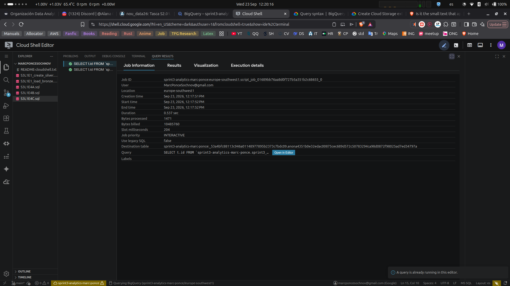

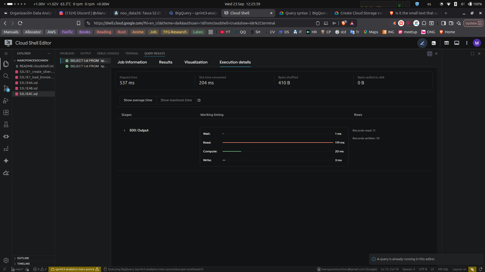

» With `transactions_raw` we can observe that the `LIMIT` did cut the amount of bytes processed. In fact, it can be further seen that only 11 records were processed. But we were billed `10MB` regardless.

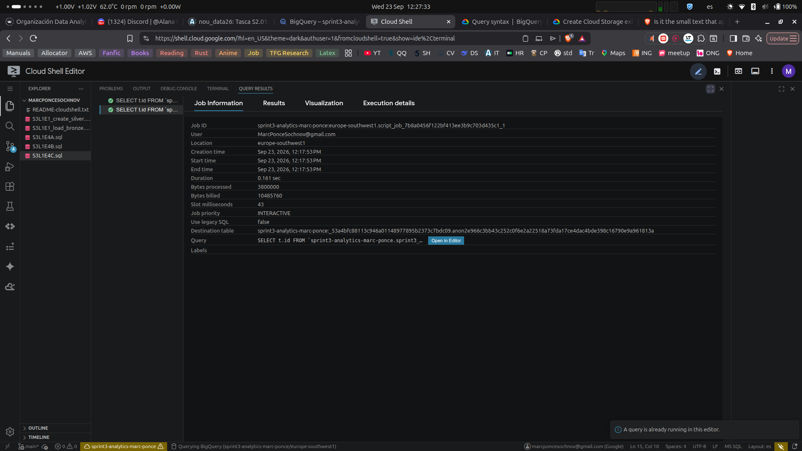

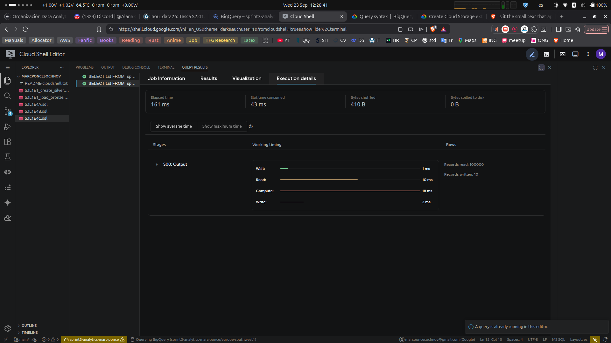

» With `transactions_raw_native` we are billed the same `10MB`. It is faster, and most likely uses less energy. The amount of bytes processed doesn't differ from the `dry-run` lower bound estimation, and it reads and processes all `10000` records.

» `LIMIT` does make the numbers change, but it does not pause the machine after reading the first ten rows. Consulting an AI search engine I have come to the following information:

> “Although the `LIMIT` clause limits the rows that a query produces, it doesn't limit the amount of data processed by that query.”

» Apparently Google's documentation explicitly recommends not to use `LIMIT` as a cost control mechanism for non-clustered tables. Secondly, BigQuery has a minimum billing amount of `10MB` for on-demand queries.

» For the `EXTERNAL TABLE`, BigQuery is querying the underlying external data rather than Google's own optimized native storage. Conceptually, this means that the `.csv` file must be read and parsed to produce the tabular data required by the query, rather than being accessed through BigQuery's native columnar storage.
### Exercici 5: Adaptació de Sintaxi "Reporting"

> El teu cap vol saber quins van ser els **5 dies amb més ingressos de l'any 2021**.

#### 💪 Repte:

Probablement, el camp `timestamp` és un `STRING`. Hauràs d'investigar funcions de BigQuery (`SUBSTR`, `CAST`, `PARSE_TIMESTAMP`) per filtrar l'any i agrupar per data correctament.

» The `timestamp` field is, in fact, not a `string`. BigQuery had loaded it into the proper `TIMESTAMP` form.

```SQL
SELECT
    DATE(t.timestamp) AS t_day,
    ROUND(SUM(t.amount), 2) AS day_total
FROM `sprint3-analytics-marc-ponce.sprint3_bronze.transactions_raw_native` AS t
WHERE t.declined = 0
GROUP BY t_day
ORDER BY day_total DESC
LIMIT 5;
```

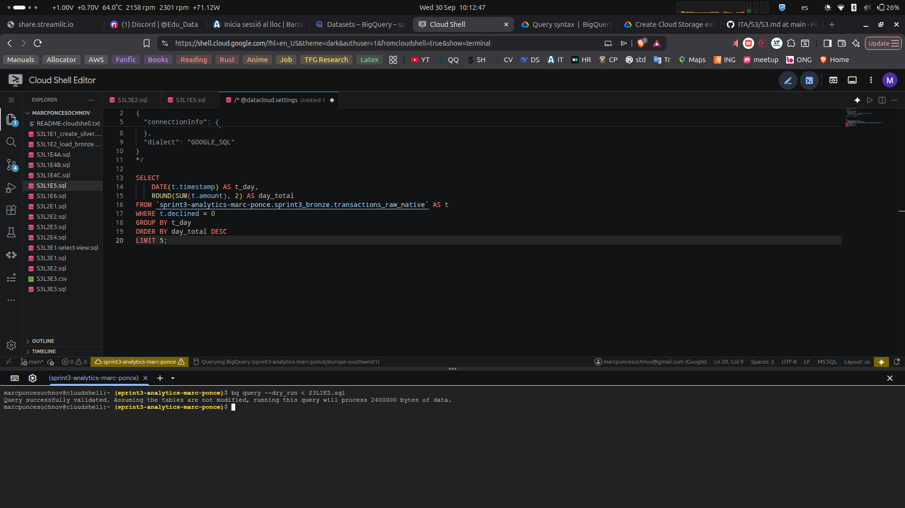

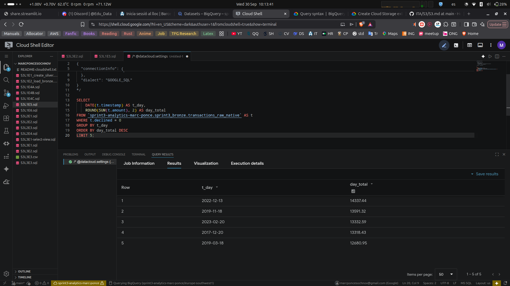

» It took me a few tries to execute the right code (I was correcting), and it seems that given that I was querying pretty much the same information, it was cached somewhere between the database and my endpoint, thus I was not billed for this last query.

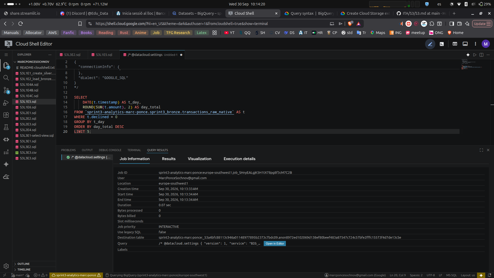

### Exercici 6: Consultes Complexes

> Necessitem un informe que creui dades.

#### 🧩 Tasca:

Llista el nom, país i data de les transaccions realitzades per empreses que van fer operacions entre 100 i 200 euros en alguna d'aquestes dates: 29-04-2015, 20-07-2018 o 13-03-2024.

```SQL
SELECT
    c.company_name,
    c.country,
    t.timestamp
FROM `sprint3-analytics-marc-ponce.sprint3_bronze.transactions_raw_native` AS t
JOIN `sprint3-analytics-marc-ponce.sprint3_bronze.companies_raw` AS c
ON t.business_id = c.company_id
WHERE t.amount BETWEEN 100 AND 200
AND DATE(t.timestamp) in ('2015-04-29', '2018-07-20', '2024-03-13');
```

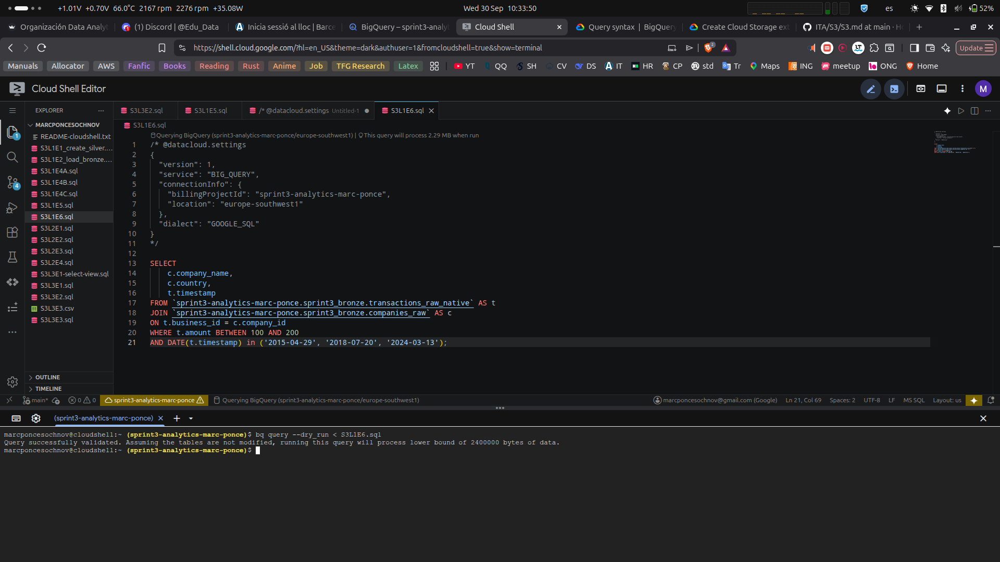

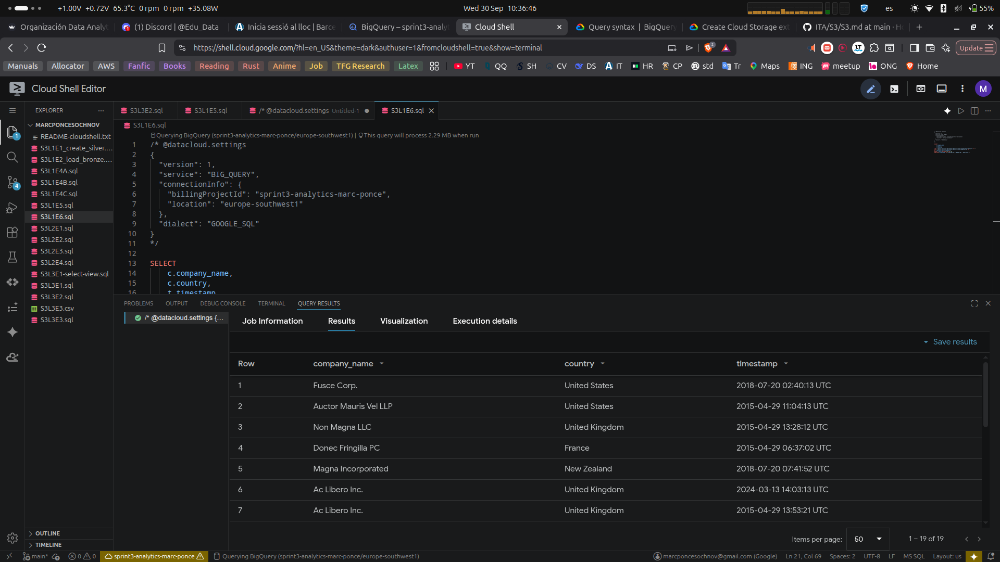

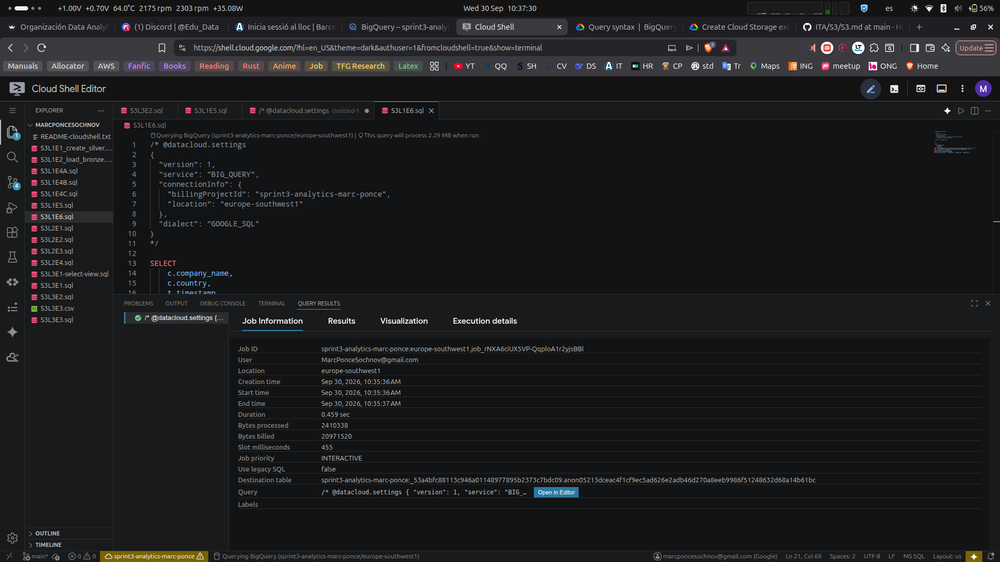

» This is the old solution: for some reason when asked about the names, I thought of the names of the users not the name of the companies.

```SQL
SELECT
    eu.name,
    c.country,
    DATE(t.timestamp) AS t_day
FROM `sprint3-analytics-marc-ponce.sprint3_bronze.transactions_raw_native` AS t
JOIN `sprint3-analytics-marc-ponce.sprint3_bronze.companies_raw` AS c
ON t.business_id = c.company_id
JOIN `sprint3-analytics-marc-ponce.sprint3_bronze.european_users_raw` AS eu
ON t.user_id = eu.id
WHERE t.amount BETWEEN 100 AND 200
AND DATE(t.timestamp) in ('2015-04-29', '2018-07-20', '2024-03-13')
UNION ALL
SELECT
    au.name,
    c.country,
    DATE(t.timestamp) AS t_day
FROM `sprint3-analytics-marc-ponce.sprint3_bronze.transactions_raw_native` AS t
JOIN `sprint3-analytics-marc-ponce.sprint3_bronze.companies_raw` AS c
ON t.business_id = c.company_id
JOIN `sprint3-analytics-marc-ponce.sprint3_bronze.american_users_raw` AS us
ON t.user_id = au.id
WHERE t.amount BETWEEN 100 AND 200
AND DATE(t.timestamp) in ('2015-04-29', '2018-07-20', '2024-03-13');
```

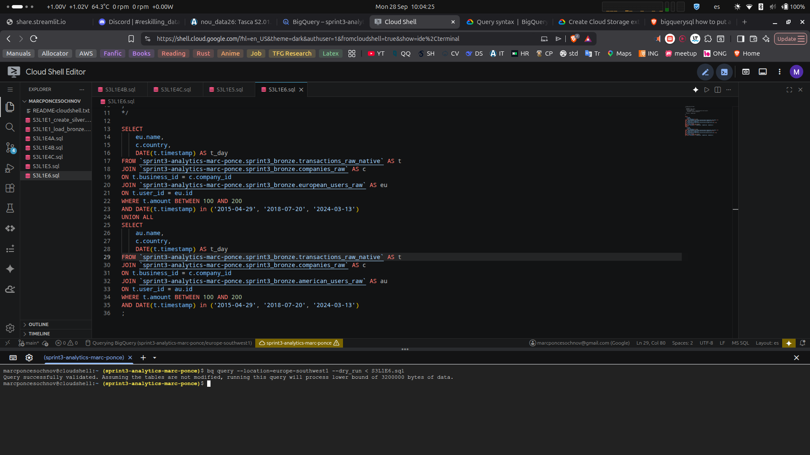

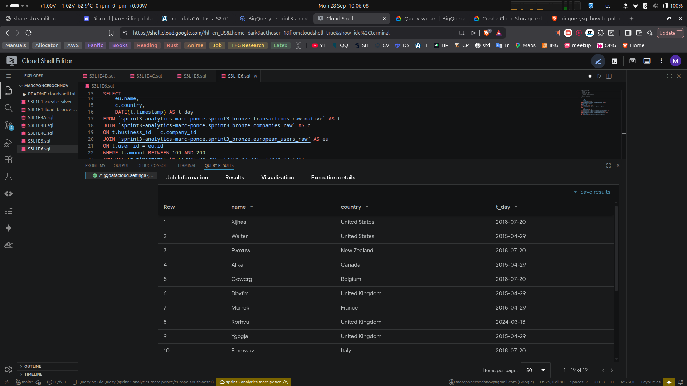

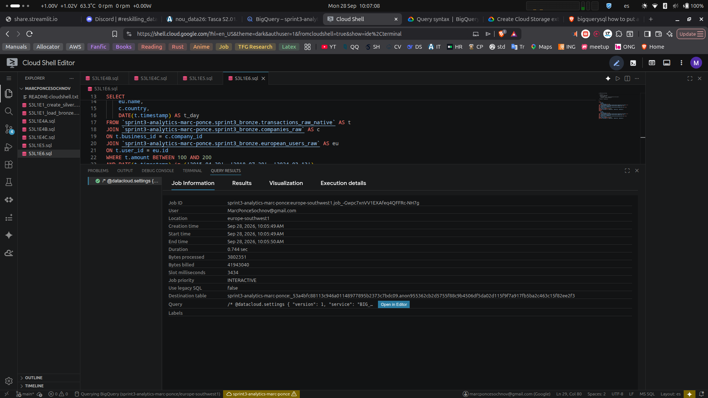

» It has occurred me that the old version code can be improved:

```SQL
WITH
    tc AS (
        SELECT
            t.user_id,
            c.country,
            t.timestamp
        FROM `sprint3-analytics-marc-ponce.sprint3_bronze.transactions_raw_native` AS t
        JOIN `sprint3-analytics-marc-ponce.sprint3_bronze.companies_raw` AS c
        ON t.business_id = c.company_id
        WHERE t.amount BETWEEN 100 AND 200
        AND DATE(t.timestamp) in ('2015-04-29', '2018-07-20', '2024-03-13')
    )
SELECT
    eu.name,
    tc.country,
    tc.timestamp
FROM tc
JOIN `sprint3-analytics-marc-ponce.sprint3_bronze.european_users_raw` AS eu
ON tc.user_id = eu.id
UNION ALL
SELECT
    us.name,
    tc.country,
    tc.timestamp
FROM tc
JOIN `sprint3-analytics-marc-ponce.sprint3_bronze.american_users_raw` AS us
ON tc.user_id = us.id;
```

## Nivell 2: Neteja i Transformació (ELT)

> #### Escenari:
> 
> Les dades brutes tenen problemes de qualitat (símbols de moneda, usuaris duplicats, dates incorrectes). Actua com a Data Engineer per netejar-ho tot.

### Exercici 1: Neteja de Productes (Data Quality)

Crearem la capa neta ("Silver") per als productes. Tens la taula `sprint3_bronze.products_raw` carregada des del CSV. L'equip de Data Governance et demana crear una taula de productes neta a `sprint3_silver.products_clean` que compleixi aquestes regles de qualitat:

- **Estandardització de Noms**: La columna original `id` és ambigua; reanomena-la a `product_id`. La columna `product_name` simplifica-la a name.
- **Neteja d'IDs**: El camp `warehouse_id` té el format antic "WH-4". Elimina el prefix "WH-" i converteix el valor a nombre enter (INT64).
- **Garantia de Preu**: Assegura't que `price` és un número `FLOAT64`, sense símbols de moneda.
- **Altres columnes**: Conserva el camp weight (pes) tal qual.

```SQL
CREATE OR REPLACE TABLE
    `sprint3-analytics-marc-ponce.sprint3_silver.products_clean`
AS SELECT
    p.id AS product_id,
    p.product_name AS name,
    CAST(REGEXP_REPLACE(p.warehouse_id, r'[^0-9]', '') AS INT64) AS warehouse_id,
    CAST(price AS FLOAT64) AS price,
    p.colour,
    p.category,
    p.weight,
    p.brand,
    p.cost,
    p.launch_date
FROM `sprint3-analytics-marc-ponce.sprint3_bronze.products_raw` AS p;
```

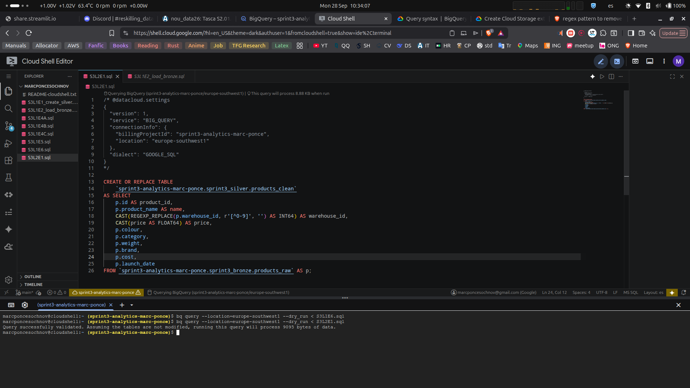

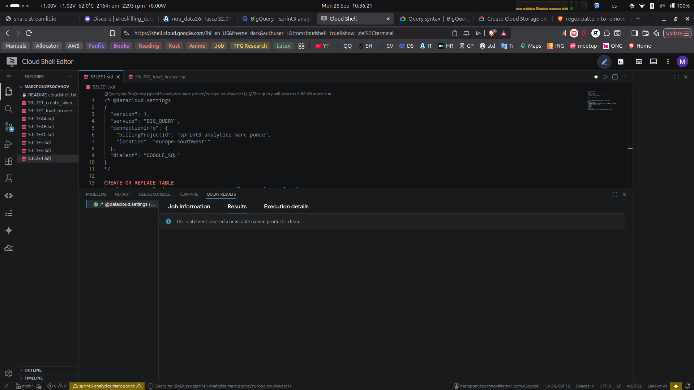

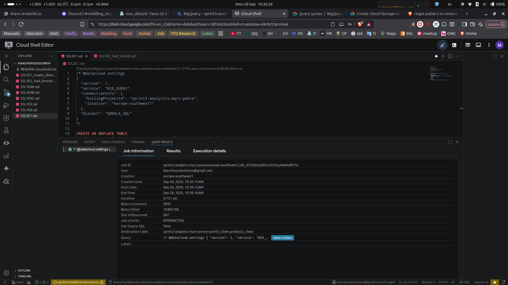

» Last, we check that the table is where it should be:

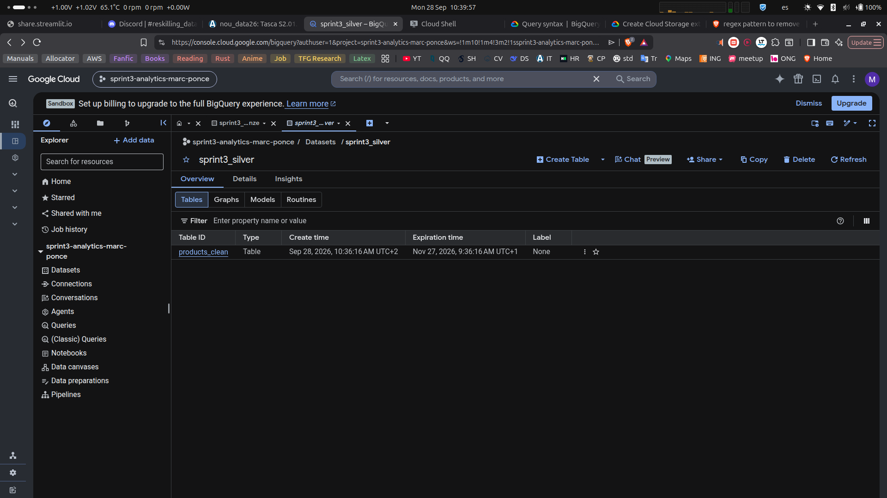

### Exercici 2: Creació de Transaccions Netes (Capa Silver)

> #### Escenari:
> 
> La taula `transactions_raw` (Bronze) és insegura: l'import (`amount`) podria tenir lletres, les coordenades podrien fallar i la data és un text difícil de filtrar. Crearem la taula definitiva `sprint3_silver.transactions_clean` que garanteixi el següent.

- **Estandardització de Noms**: La columna original `id` és ambigua; reanomena-la a `transaction_id`. 
- **Robustesa en Imports**: Utilitza `SAFE_CAST` al camp amount. Si falla, substitueix-lo per 0 (usant `IFNULL`).
- **Dates Reals**: Converteix el camp `timestamp` (que és `STRING`) a tipus `TIMESTAMP` real.
- **Coordenades**: Assegura que `lat` i `longitude` siguin `FLOAT64` (utilitza `SAFE_CAST` per seguretat).
- **Desglossa els Productes:** Transforma la cadena de text `product_ids` en un `ARRAY` d'enters.

- _Input:_ `"1, 2, 3"` `STRING`
- _Output:_ `[1, 2, 3]` `ARRAY<INT>`

- **Resta de camps**: Mantén-los igual.
 
```SQL
CREATE OR REPLACE TABLE
    `sprint3-analytics-marc-ponce.sprint3_silver.transactions_clean`
AS SELECT
    t.id AS transaction_id,
    t.business_id,
    t.card_id,
    timestamp,
    IFNULL(SAFE_CAST(t.amount AS FLOAT64), 0) AS amount,
    t.declined,
    ARRAY(
        SELECT SAFE_CAST(TRIM(product_id) AS INT64)
        FROM UNNEST(SPLIT(t.product_ids, ',')) AS product_id
    ) AS product_ids,
    user_id,
    SAFE_CAST(t.lat AS FLOAT64) AS lat,
    SAFE_CAST(t.longitude AS FLOAt64) AS longitude
FROM `sprint3-analytics-marc-ponce.sprint3_bronze.transactions_raw_native` AS t;
```

 » `SPLIT(t.product_ids, ',')` separates the IDs and transforms the field into an `ARRAY<STRING>`. Unfortunately, BigQuery's `SQL` has no function such as `MAP(...)`. Therefore, to cast each `product_id` into an `INT`, we have to transform the field into a virtual table with `UNNEST(...)`, which transforms each element of the array into a row of the table. The cast within a `SELECT` query is then straightforward—which leads to the last operation, which uses `ARRAY(...)` to transform the virtual table back into an `ARRAY<INT64>` data type.
 
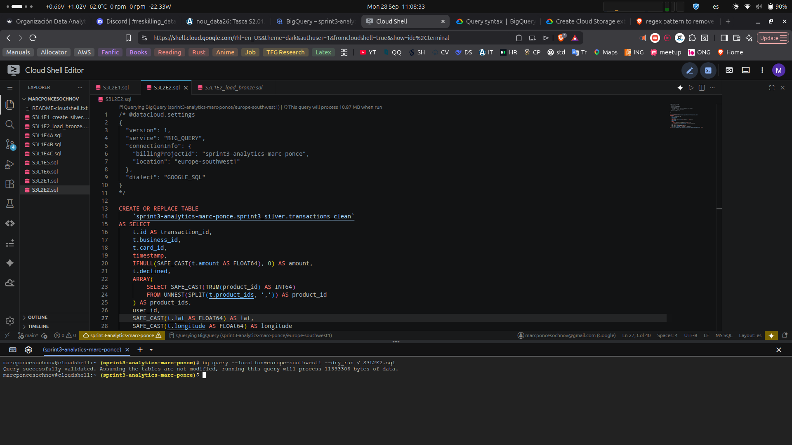

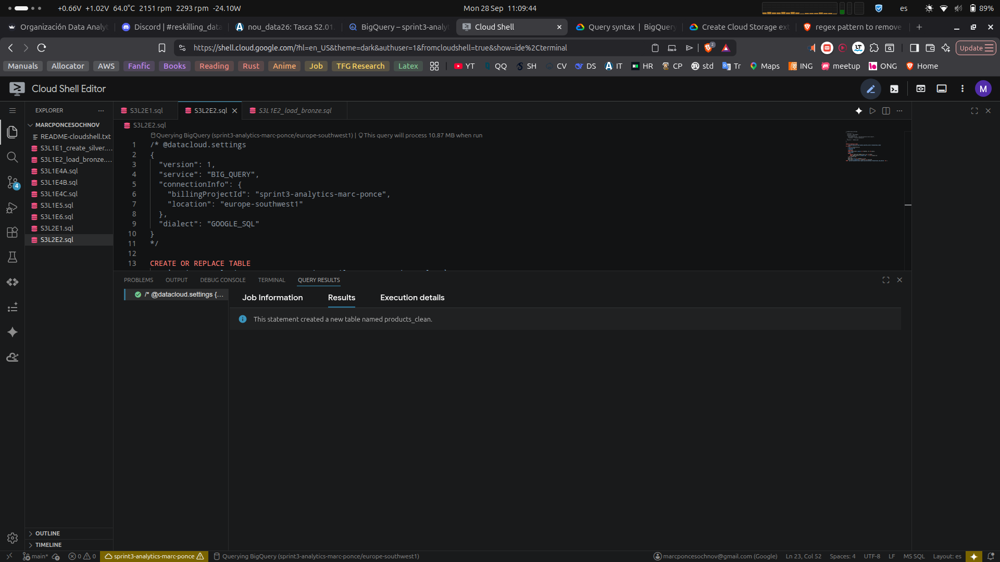

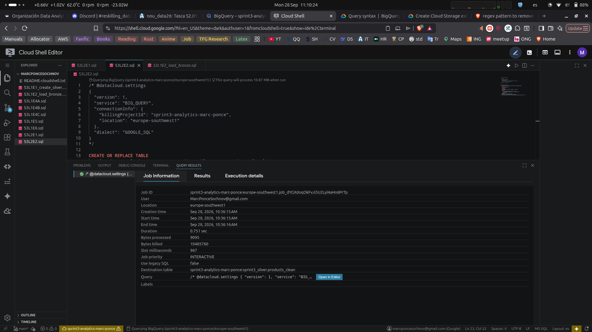

» Finally we check that the table is in place:

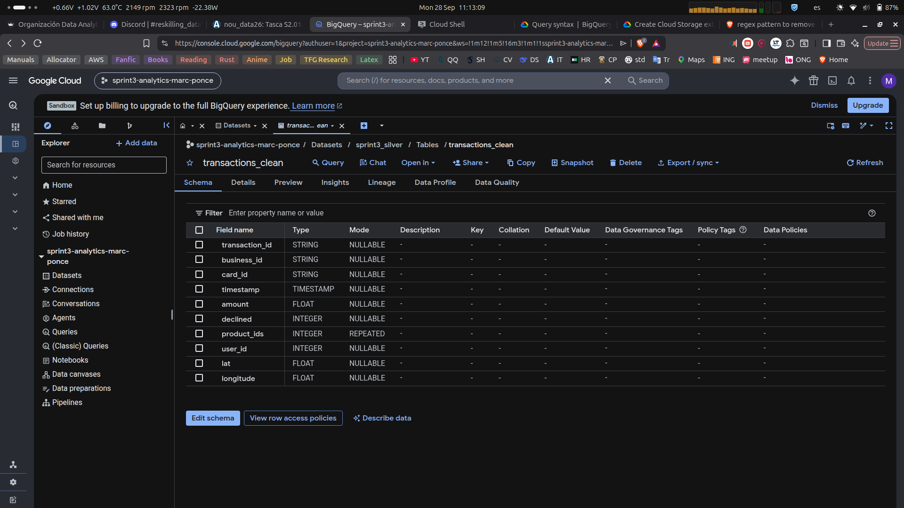

» `REPEATED` means that the field holds zero or more values of the specified type (i.e., `INT64` in this example).

### Exercici 3: Unificació d'Usuaris (UNION)

Tenim els usuaris fragmentats per regió.

#### 🧩 Tasca:

Crea la taula `sprint3_silver.users_combined`. Utilitza `UNION ALL` per unificar els usuaris dels EUA i Europa en una única llista mestra. Afegeix una columna calculada `origin` per saber d'on venen.

- **Estandardització de Noms**: La columna original `id` és ambigua; reanomena-la a `user_id`.

```SQL
CREATE OR REPLACE TABLE
    `sprint3-analytics-marc-ponce.sprint3_silver.users_combined`
AS SELECT
    eu.id AS user_id,
    eu.name,
    eu.surname,
    eu.phone,
    eu.email,
    eu.birth_date,
    eu.country,
    eu.city,
    eu.postal_code,
    eu.address,
    'EU' AS origin
FROM `sprint3-analytics-marc-ponce.sprint3_bronze.european_users_raw` AS eu
UNION ALL
SELECT
    au.id AS user_id,
    au.name,
    au.surname,
    au.phone,
    au.email,
    au.birth_date,
    au.country,
    au.city,
    au.postal_code,
    au.address,
    'US' AS origin
FROM `sprint3-analytics-marc-ponce.sprint3_bronze.american_users_raw` AS au;
```

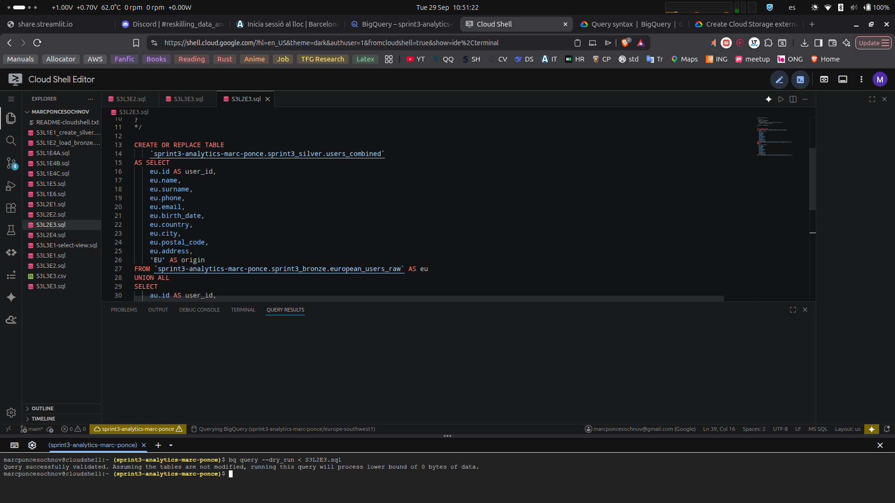

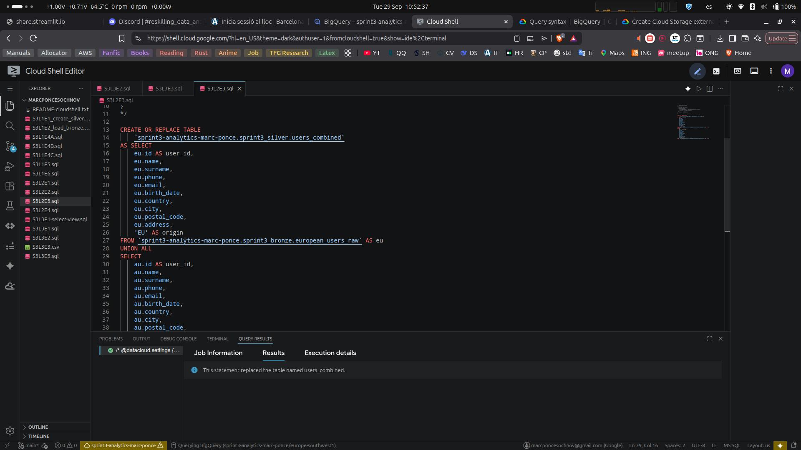

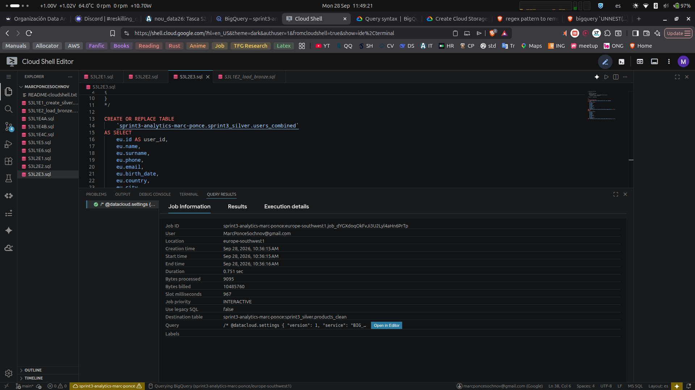

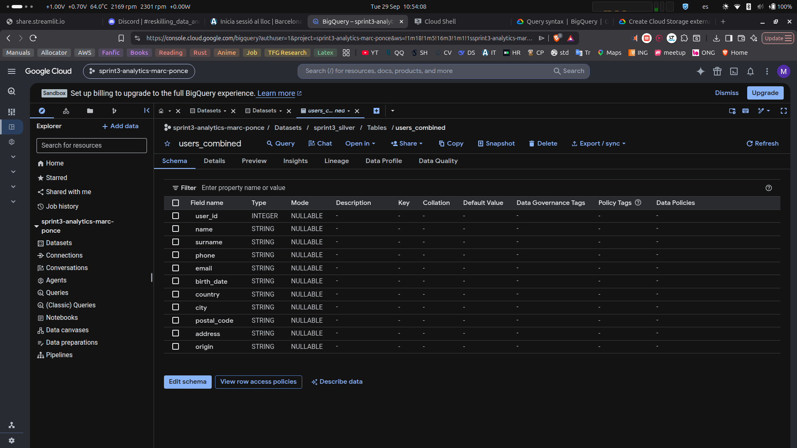

### Exercici 4: Materialització de Companyies i Targetes de Crèdit

> #### Escenari:
> 
> Per completar el model de dades a la capa Silver, ens falten dues dimensions clau que actualment depenen de fitxers CSV externs: **Companyies** i **Targetes de Crèdit**. No podem dependre de fitxers solts per a l'anàlisi final. Hem d'importar aquestes dades a taules natives (Silver) i aprofitar per corregir formats.

#### 🧩 Tasques:

- 1. Crea la taula `sprint3_silver.companies_clean`. Copia les dades tal qual, però assegura't que sigui una taula nativa de BigQuery (no una vista externa).
- 2. Crea la taula `sprint3_silver.credit_cards_clean`. Copia les dades tal qual, però assegura't que sigui una taula nativa de BigQuery (no una vista externa).

Si cal, reanomenar l'`id` segons correspongui.

```SQL
CREATE OR REPLACE TABLE
    `sprint3-analytics-marc-ponce.sprint3_silver.companies_clean`
AS SELECT *
FROM `sprint3-analytics-marc-ponce.sprint3_bronze.companies_raw` AS c;

CREATE OR REPLACE TABLE
    `sprint3-analytics-marc-ponce.sprint3_silver.credit_cards_clean`
AS SELECT *
FROM `sprint3-analytics-marc-ponce.sprint3_bronze.credit_cards_raw` AS c;
```

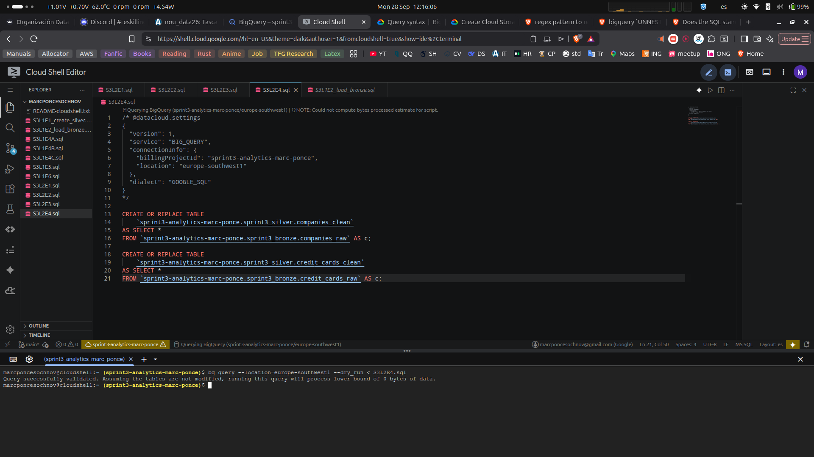

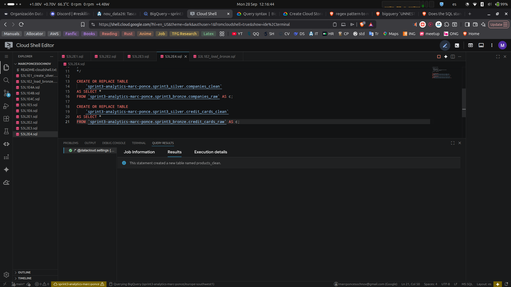

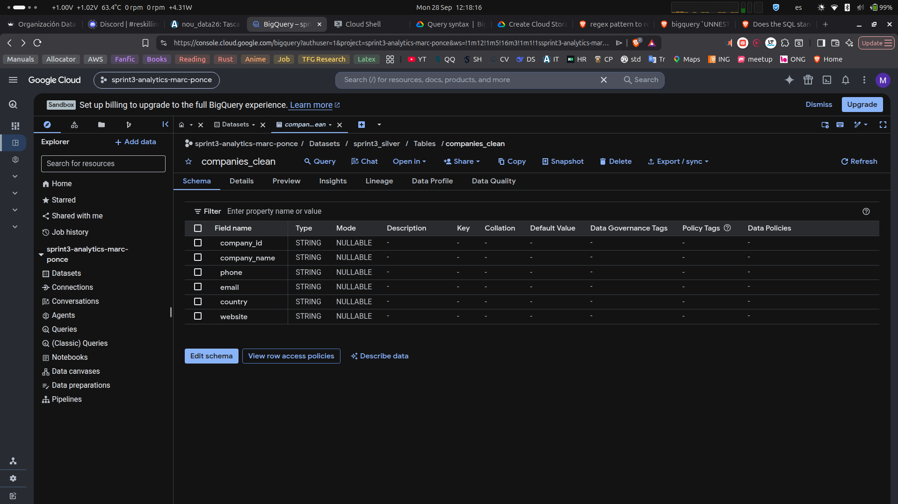

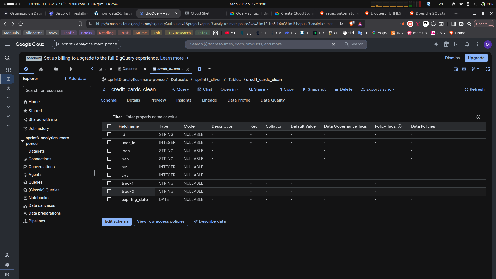

## Nivell 3: Presentació de Dades i Creació de Vistes

> #### Escenari:
> 
> Al nivell anterior vas actuar com a Data Engineer netejant les dades (_clean_). Ara toca posar-se el barret d'Analista de Negoci. El problema actual és que les taules estan separades i algunes tenen formats difícils d'explotar (com la llista de productes comprimida en una sola cel·la). En aquest nivell crearàs **Vistes** per facilitar l'accés a la informació i generaràs informes finals.

#### 🎯 Objectius:

- Crear Vistes (`CREATE VIEW`) per encapsular lògica de negoci complexa.
- Resoldre el repte de dades agrupades en strings (`SPLIT` + `UNNEST`).
- Exportar resultats per a tercers (`Reverse ETL`).

### Exercici 1: La Vista de Màrqueting (Lògica de Negoci)

> Màrqueting necessita segmentar els clients corporatius, però no saben fer JOINs. La teva tasca és deixar-los la informació preparada.

#### 🧩 Tasca:

Crea una vista anomenada `sprint3_gold.v_marketing_kpis` que mostri la següent informació per a cada companyia:

- **Nom de la companyia, Telèfon i País** (origen: `companies_clean`).
- **Mitjana de compra** (`AVG(amount)` de `transactions_clean`).
- **Classificació de Client (Lògica)**:
    - Crea una columna calculada anomenada `client_tier`.
    - Si la mitjana de compra és superior a **260 €**, etiqueta com a **"Premium"**.
    - Si és igual o inferior, etiqueta com a **"Standard"**.

#### 👉 Entrega:

Realitza una consulta `SELECT *` sobre la teva nova vista, ordenant els resultats perquè apareguin primer els clients "Premium" i, dins d'aquests, els que tinguin major mitjana de compra.

```SQL
CREATE OR REPLACE VIEW
    `sprint3-analytics-marc-ponce.sprint3_gold.v_marketing_kpis`
AS WITH
    a AS (
        SELECT
            c.company_id,
            c.company_name,
            c.phone,
            c.country,
            AVG(t.amount) AS avg_amount
        FROM `sprint3-analytics-marc-ponce.sprint3_silver.companies_clean` AS c
        JOIN `sprint3-analytics-marc-ponce.sprint3_silver.transactions_clean` AS t
        ON t.business_id = c.company_id
        WHERE t.declined = 0
        GROUP BY
            c.company_id,
            c.company_name,
            c.phone,
            c.country
    )
SELECT
    a.company_name,
    a.phone,
    a.country,
    a.avg_amount,
    CASE
        WHEN a.avg_amount > 260 THEN 'Premium'
        ELSE 'Standard'
    END AS client_tier
FROM a;
```

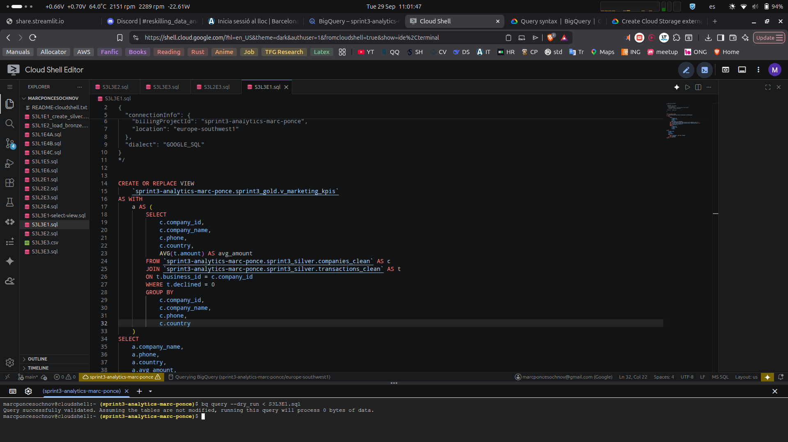

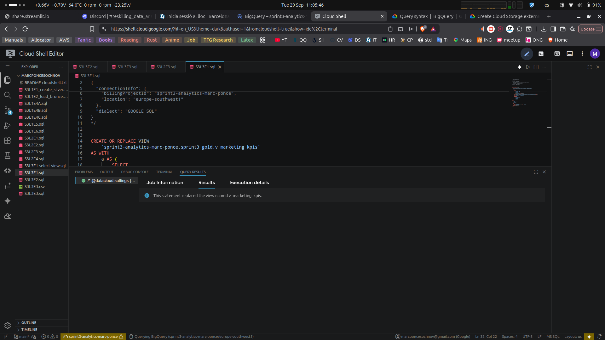

» No bytes billed:

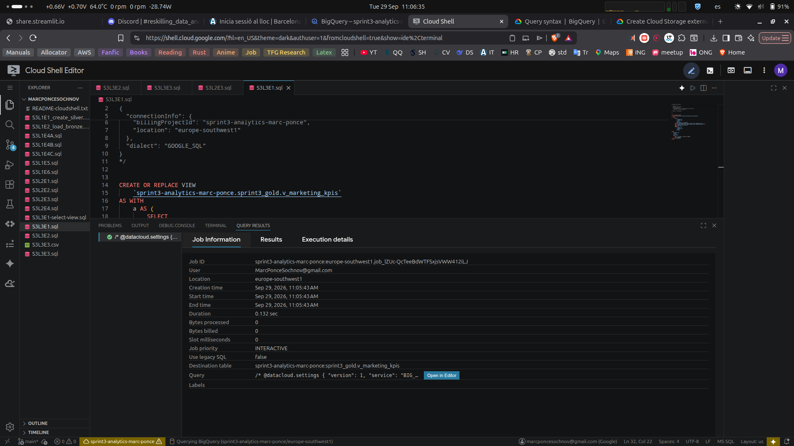

```SQL
SELECT *
FROM `sprint3-analytics-marc-ponce.sprint3_gold.v_marketing_kpis`
ORDER BY avg_amount DESC;
```

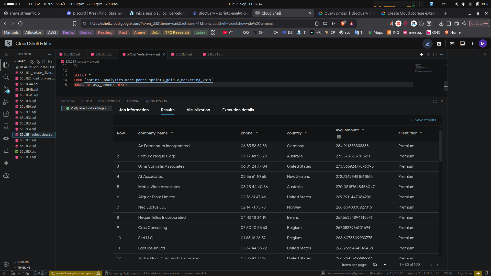

### Exercici 2: Rànquing de Productes (La Potència dels `ARRAY`s)

> #### Escenari de Negoci:
> 
> L'equip de vendes vol optimitzar el catàleg. Necessiten un informe a la capa Gold que mostri el rendiment real de cada producte. Gràcies a la teva bona enginyeria a la capa Silver, la taula `transactions_clean` ja té els IDs de producte perfectament organitzats en una llista (`ARRAY`). Ara toca explotar aquesta estructura.

#### 🎯 Objectiu:

Crea la taula `sprint3_gold.product_sales_ranking` que contingui l'inventari complet de productes i quantes vegades s'ha venut cadascun.

#### 📝 Requisits de l'Informe:

- **Detall del Producte**: Ha d'incloure `product_id`, `name`, `price` i `color` (venen de la taula `products_clean`).
- **Mètrica de Negoci**: Una columna nova `total_sold` que compti quantes vegades apareix aquest producte a les transaccions.
- **Integritat**: Han d'aparèixer tots els productes, fins i tot els que tenen 0 vendes (potser cal descatalogar-los).

#### 💡 Pista Tècnica:

- A `transactions_clean`, els productes estan "encapsulats" dins d'un `ARRAY` per cada transacció.
- Primer necessitaràs "aplanar" la taula de transaccions usant `UNNEST(product_ids)` per poder comptar els productes individualment.
- Després, fes un encreuament (`LEFT JOIN`) començant per la taula de productes per no perdre aquells que no s'han venut mai.

```SQL
CREATE OR REPLACE TABLE
`sprint3-analytics-marc-ponce.sprint3_gold.product_sales_ranking`
AS WITH
    p_counts_raw AS (
        SELECT
            product_id,
            COUNT(1) AS total_sold
        FROM `sprint3-analytics-marc-ponce.sprint3_silver.transactions_clean` AS t
        CROSS JOIN UNNEST(t.product_ids) AS product_id
        WHERE t.declined = 0
        GROUP BY product_id
    )
SELECT
    p.product_id,
    p.name,
    p.price,
    p.colour,
    COALESCE(c.total_sold, 0) AS total_sold
FROM `sprint3-analytics-marc-ponce.sprint3_silver.products_clean` AS p
LEFT JOIN p_counts_raw AS c
ON p.product_id = c.product_id
ORDER BY total_sold DESC;
```

» As it was said earlier `UNNEST(...)` is used to convert the `ARRAY` into a virtual table, which we can then `JOIN LATERAL` with its origin table `transactions_clean`. BigQuery has `LATERAL` reserved for something else, so the syntax is `CROSS JOIN`. `COALESCE(val0, val1, ...)` yields the first `NOT NULL` value. In this case it is used so the  `NULL` values left by the `LEFT JOIN` fall back to `0`.

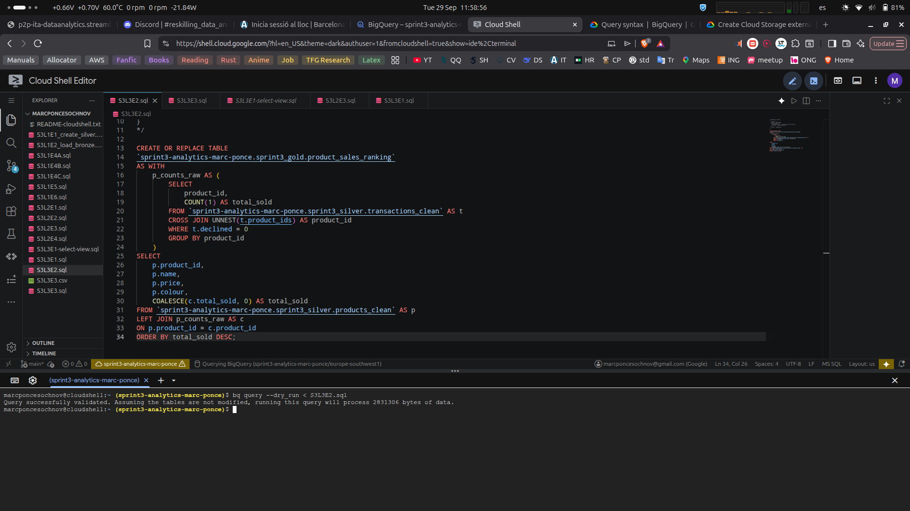

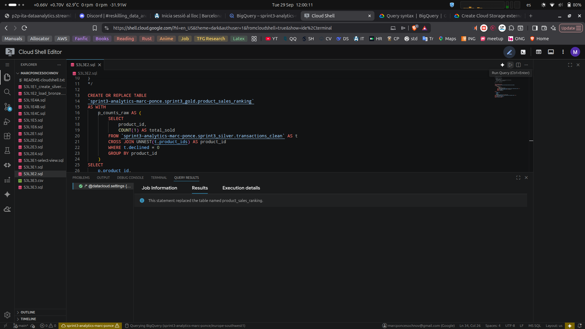

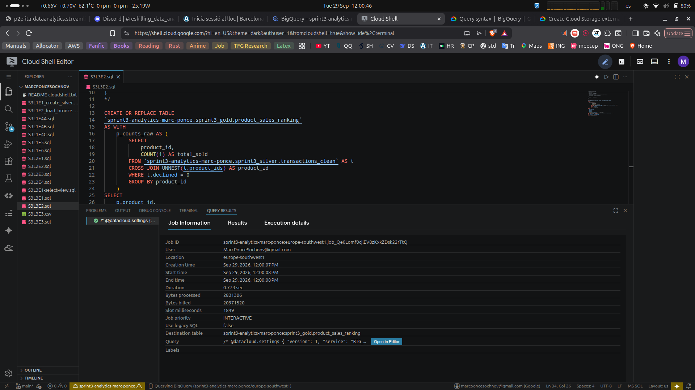

### Exercici 3: Exportació de Resultats

> El teu mànager no té accés a BigQuery i vol el llistat de "Top Productes" en un Excel per a una reunió.

#### 🧩 Tasca:

Exporta les dades de la taula `product_sales_ranking` a **Google Sheets** o baixa l'arxiu **CSV** localment.

#### 👉 Entrega:

Una captura de pantalla on es vegi l'arxiu obert (Excel/Sheets) amb les dades correctament formatades.

```SQL
SELECT *
FROM `sprint3-analytics-marc-ponce.sprint3_gold.product_sales_ranking`;
```

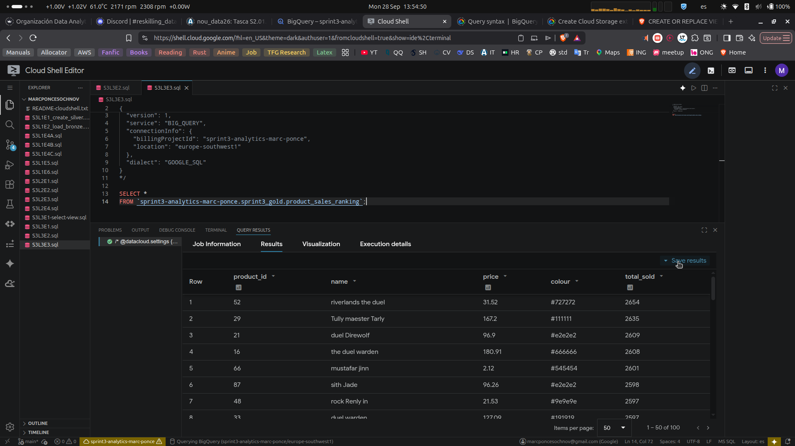

```bash
bq query \
    --format=csv \
    --max_rows=1000000 \
    < S3L3E3.sql \
    > S3L3E3.csv
```

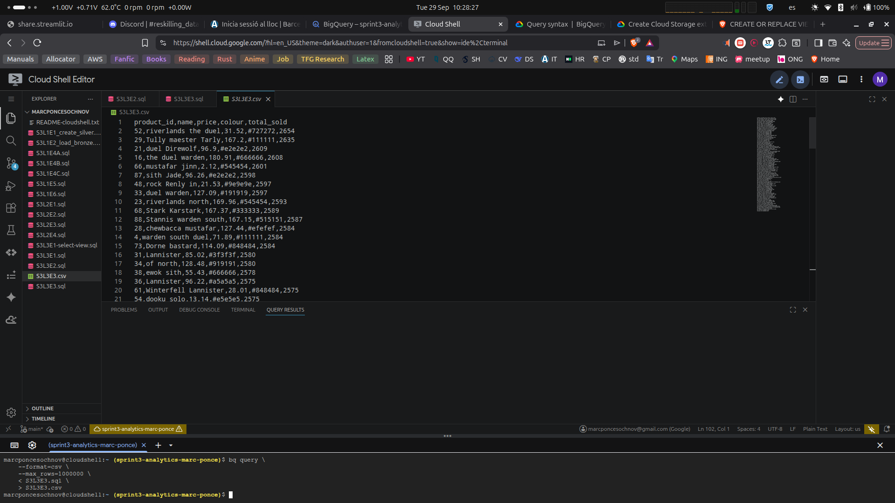

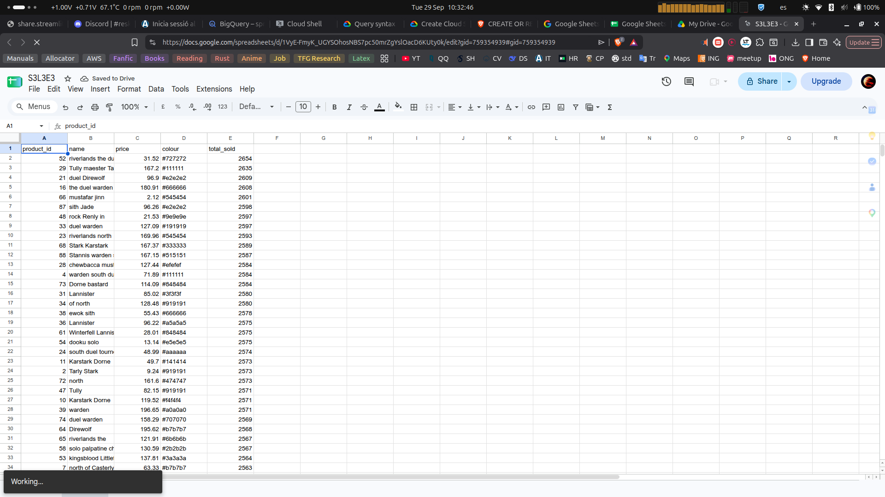
